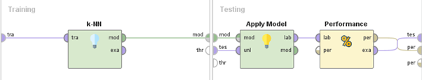
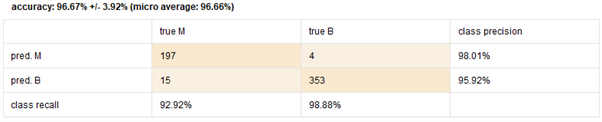
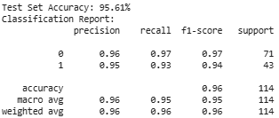
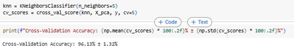

# 🧬 Breast Cancer Diagnosis with PCA and K-Nearest Neighbors

This project was created for the **Machine Learning** course during my **Master’s degree (S2)** in Information Technology.  
**Submission Date**: March 24, 2025

## 🧠 Overview
The project involves diagnosing breast cancer (Benign or Malignant) using **feature reduction with Principal Component Analysis (PCA)** and classification using **K-Nearest Neighbors (KNN)**.

## 📌 Objective
To classify breast tumors as **Benign (0)** or **Malignant (1)** using **Principal Component Analysis (PCA)** for dimensionality reduction and **K-Nearest Neighbors (KNN)** as the classification algorithm.  
The model was implemented and evaluated using both **RapidMiner** and **Python**, with detailed performance comparison.

---

## 📚 Dataset
- Source: [UCI Breast Cancer Wisconsin Diagnostic Dataset](	https://archive.ics.uci.edu/dataset/17/breast+cancer+wisconsin+diagnostic)
- Samples: 569
- Features: 30 numerical measurements (e.g., radius, texture, perimeter, area)
- Target: `0 = Benign`, `1 = Malignant`

---

## 🧪 Tools & Libraries
- RapidMiner Studio
- Python 3, Jupyter Notebook
- Libraries: `pandas`, `scikit-learn`, `matplotlib`, `seaborn`, `numpy`

---
## ⚙️ Methodology
### Overall Flow
1. **Preprocessing**: Standardization & normalization of features
2. **Feature Selection**: Applied PCA to reduce dimensionality
3. **Modeling**: Used KNN classifier on transformed features
4. **Evaluation**

### 📌 RapidMiner Workflow

The visual workflow in RapidMiner includes PCA, normalization, cross-validation, and KNN classifier.

### 📌 Cross Validation in RapidMiner

KNN was implemented with **K=5**, evaluated using **5-Fold Cross Validation**.

---
## 📊 Results

### 📈 RapidMiner Results

- Accuracy: **96.67% ± 3.92%**
- Evaluation used 5-Fold Cross Validation with K = 5

---

### 🐍 Python Results

#### 🔍 Test Set Accuracy & Classification Report

- Test Set Accuracy: **95.61%**
- The model performed slightly better on benign cases but still achieved high precision and recall on malignant cases — which is crucial in medical diagnosis.

#### 🔁 Cross-Validation Accuracy (Python)

- Accuracy: **96.13% ± 1.32%**
- Same result as RapidMiner, confirming the model’s consistency and reliability across different tools

### 📌 PCA (Principal Component Analysis)

PCA was used to reduce dimensionality from 30 features to 10 principal components.  
These 10 components explain **95.15%** of the total variance:

Explained Variance Ratio:  
`[0.44272026, 0.18971182, 0.09393163, 0.06602135, 0.05495768, 0.04024522, 0.02250734, 0.01588724, 0.01389649, 0.01168978]`

PCA helped improve computational efficiency while retaining the most important patterns from the data.

## ✅ Conclusion

| Evaluation Type     | Accuracy           |
|---------------------|--------------------|
| RapidMiner (CV)     | 96.67% ± 3.92%     |
| Python (Test Split) | 95.61%             |
| Python (CV)         | 96.13% ± 1.32%     |

- **PCA** successfully reduced the feature space from 30 to 10 while retaining over 95% variance.
- **KNN (k=5)** produced strong and stable performance across both platforms.
- The model proved highly capable in identifying **malignant tumors**, which is vital for early detection and treatment in real-world scenarios.

